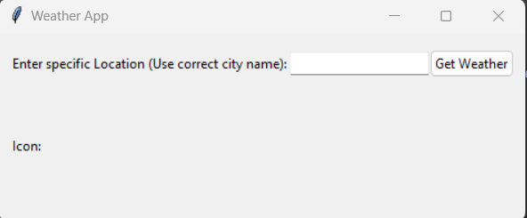
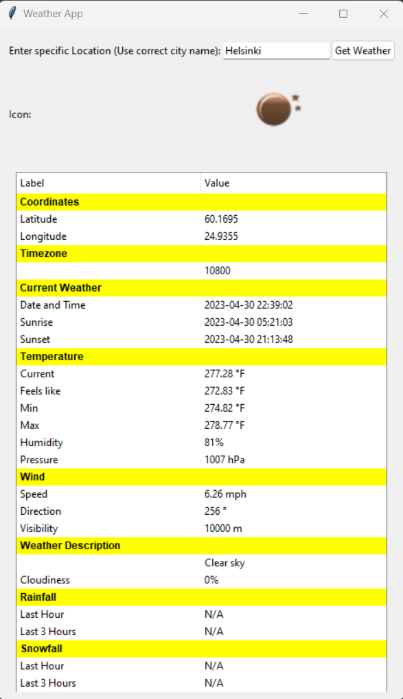

#Day 3 Tasks
# Email Counter

This Python code reads a text file containing email messages and counts the number of occurrences of each unique email address, as well as the frequency of each email domain. It then determines which email address has the most occurrences and prints the result to the console.

Usage:
1. Save the text file containing email messages in the same directory as this script and update the `file_path` variable with the correct file name.
2. Run the script using a Python interpreter.
3. The script will output the total number of lines, the email address with the most occurrences, the number of occurrences, and the frequency of other domains.

Note:
This script expects the text file to have a specific format. It is designed to work with files containing email messages in the "mbox" format, which starts each email with a line starting with "From ". If the file format is different, the script may not work correctly.
# Generate Primes
The function first creates an empty list primes to store the prime numbers.
 It then uses a for loop to iterate over all numbers from 2 to n. For each number, 
 the function checks whether it is prime by testing whether it is divisible by any number between 2 and its square root (inclusive). 
 If the number is prime, it is added to the primes list.

Finally, the function returns the primes list containing all prime numbers less than or equal to n.

You can call the function by passing a positive integer n as an argument, like this:

    primes = generate_primes(20)
    print(primes)  # Output: [2, 3, 5, 7, 11, 13, 17, 19]

This will generate a list of all prime numbers less than or equal to 20 and store it in the primes 
variable, which is then printed to the console."""

# Weather App
This is a Python application that displays weather information for a specific location using the OpenWeatherMap API. It uses the Tkinter library to create a graphical user interface (GUI) for the application.


## Requirements
To run this application, you will need:

1. Tkinter
2. requests
3. json
4. PIL
## Installation and Usage
Step 1: Clone the repository
```'
git clone https://github.com/maya-tsedeke/Brainnest.git
````
Step 2: Navigate to the project directory
```'
cd Brainnest/Week4-Project-advance
````
Step 3: Install the required libraries
```'
git pip install -r requirements.txt
````
Step 4: Run the application
```'
git python weather_app.py
````
The application will display a GUI with a text box to enter a location and a button to get the weather data for that location. When the button is clicked, the application will make an API call to OpenWeatherMap and display the weather data in a tree view widget.

## Credits
This project was created by ChatGPT and is based on the OpenWeatherMap API.